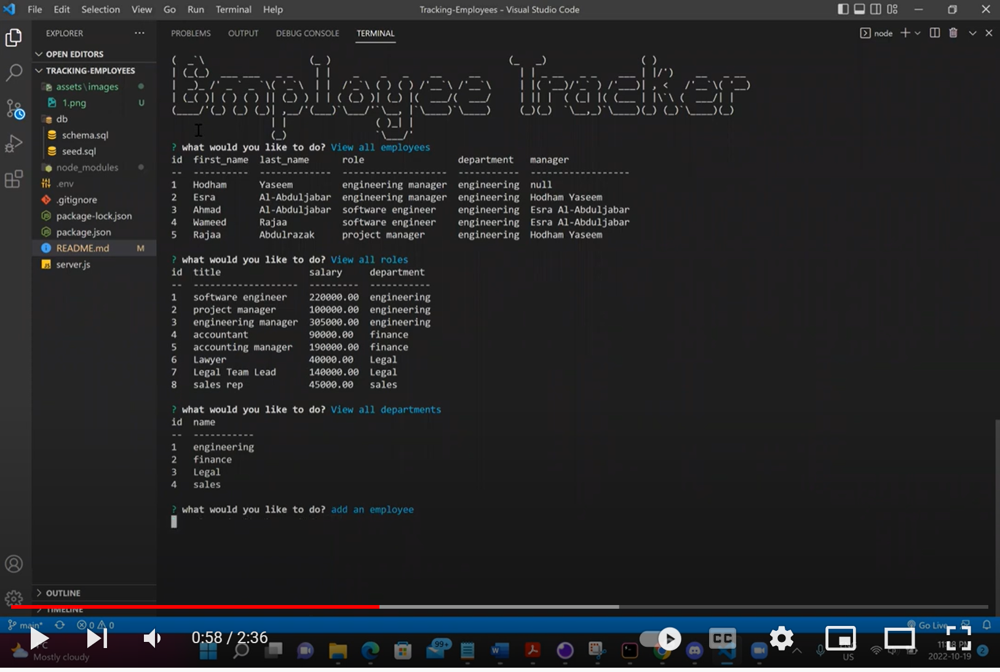
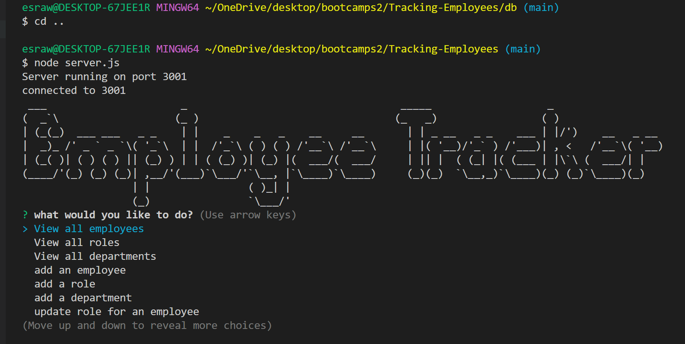

# Tracking-Employees
 ## Videos and Application Image
  - You can click on either the image or this link to access the video https://www.youtube.com/watch?v=SKNfqD-BV8E&ab_channel=EsraAl-Abduljabar
 

## Description
This application was created for business owners to keep track of all the different departments, employees, and employee roles they manage, as well as efficiently add new employee roles, departments, and update them as needed. 
## features
- Ability to select actions such as viewing all employees, roles, and department.
- Ability to add roles, employees, departments, and update them.
- Ability to return department budget through sum property.
## Technologies Used
- javascript: to add functionality.
- Node.js: to run javaScript in the Backend (Environment).
- mySQL: to create and reference tables in database.
- cTable: Format arrays.
- Figlet: to create ascii art in console.

## CLI Application Image

## Installation
### Clone code to your local machine and execute the following commands.
- npm install
- mysql -uroot -p and enter your password
- source db/scheema.sql; and source db/seed.sql;
- quit 
- node server.js

